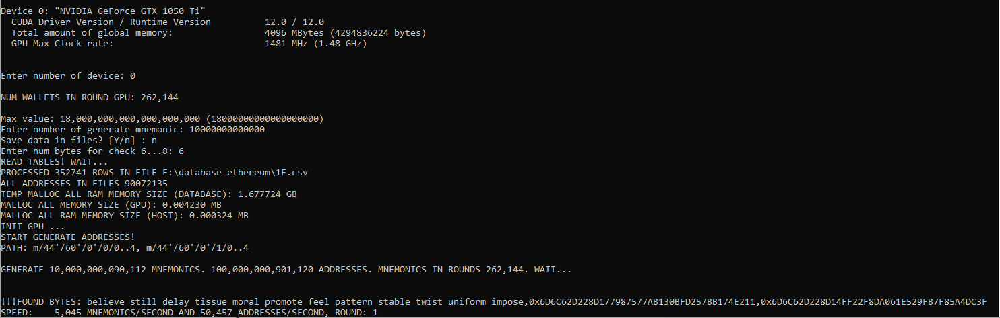

# Brute-force Mnemonic Ethereum on GPU(CUDA)
## (Version 1.0)
## Генерация мнемонических фраз Ethereum и соответствующих приватных ключей адресов m/44'/60'/0'/0/x, m/44'/60'/0'/1/x. Поиск адресов в базе.

## Файл config.cfg
* ***"folder_database": "F:\\database"***  - путь к папке с таблицами искомых адресов. Адреса в таблицах должны быть в формате hash160 и отсортированы программой https://github.com/Houzich/Convert-Addresses-To-Hash160-For-Brute-Force.
* ***"folder_save_result": "F:\\result"*** - путь к папке, куда будут сохраняться файлы со сгенерированной мнемоникой и соответствующие адреса.
* ***"lines_in_file_save": 13107200*** - количество строк в одном файле.
* ***"cuda_grid": 1024*** - настройка под видеокарту.
* ***"cuda_block": 256*** - настройка под видеокарту.
Кол-во генерируемых мнемоник за раунд равно cuda_grid*cuda_block.

## Описание
При запуске программы, считываются настройки из файла config.cfg.
В консоли выводится надпись
> *Detected 3 CUDA Capable device(s)*

где число 3  - это количество найденных видеокарт NVIDIA.
Далее выводятся характеристики каждой карты:
> *Device 0: "NVIDIA GeForce GTX 1050 Ti"*

> *...*

> *Device 1: "NVIDIA GeForce GTX 1050 Ti"*

> *Enter the number of the used video card:*

Нужно ввести номер используемой карты.
Начинается считывание и преобразование файлов баз с адресами:
> *PROCESSED 2168134 ROWS IN FILE F:\\database\A0.csv*
> *.....*

Где 2168134 - это кол-во адресов в файле. Адреса в файле хранятся в 20 байтовом формате hash160 в виде hex-строки. И отсортированы по возрастанию.

> *Enter number of generate mnemonic:*

Общее кол-во мнемоник которое мы хотим генерировать. Это введено для проверки скорости генерации или для сохранения результатов генерации в файлы. Если хотим бесконечно, то устанавливаем максимальное значение 18000000000000000000.

> *Save data in files? [Y/n]:*

Мнемоника и соответствующие ей адреса записываются в файлы количеством строк *"lines_in_file_save"*. Файлы нумеруются по порядку 0000.csv...9999.csv. Общая скорость генерации снижается из-за преобразования сгенерированных hash160 в адреса и данных на жесткий диск. 

> *Enter num bytes for check 6...8:*

Можно ввести количество байт по которым будет производиться дополнительная сверка. Чтоб пропустить этот шаг нужно ввести 0.
Если ввести число(6...8), то адреса будут проверяться на совпадение еще и по заданному количеству байт.

Далее выводится кол-во кошельков генерируемых за раунд. И начинается процесс генерации.
В ходе работы программы, постоянно обновляется надпись

> *SPEED: 250,234 MNEMONICS/SECOND AND 2,500,340 ADDRESSES/SECOND, ROUND: 9*

Кол-во мнемоник и кол-во адресов генерируемых за секунду. В данном случае, для каждого сгенерированного кошелька генерировалось 10 адресов. 5 адресов патча m/44'/60'/0'/0/X и 5 адресов патча m/44'/60'/0'/1/X

## Проверка на совпадение по байтам
Если при старте программы ввести
> *Enter num bytes for check 6...8:*

к примеру, 6. То периодически на экране будут появляться надписи такого формата:
> *!!!FOUND BYTES: chicken jewel keen arm artefact disorder gravity claim sick female verb faint,0x92F96C980AA87A1580961851A0EF93B578EAFFB8,0x92F96C980AA80E283AE965BC5EB0B7BAB11AE333*

Мнемоника сгенерированного кошелька. Его адрес. Адрес в базе, который совпал по первым байтам с адресом мнемоники. Можно посчитать одинаковые байты и убедиться в этом.
Все эти адреса сохраняются в лог-файл Found_Bytes.csv.
В файле, строки хранятся в виде: 
*chicken jewel keen arm artefact disorder gravity claim sick female verb faint,0x92F96C980AA87A1580961851A0EF93B578EAFFB8,0x92F96C980AA80E283AE965BC5EB0B7BAB11AE333,Sun Apr  2 12:51:42 2023*

# Если нашли кошелек
В консоли появиться надписи:
> * !!!FOUND!!! 
!!!FOUND!!! 
!!!FOUND!!! 
!!!FOUND!!! 
!!!FOUND: chicken jewel keen arm artefact disorder gravity claim sick female verb faint, 0x92F96C980AA87A1580961851A0EF93B578EAFFB8 
!!!FOUND!!! 
!!!FOUND!!! 
!!!FOUND!!! 
!!!FOUND!!!*

Соответственно мнемоника и адрес который мы нашли. И информация добавиться в файл Found_Addresses.csv.
В файле строки хранятся в виде: 
*chicken jewel keen arm artefact disorder gravity claim sick female verb faint, 0x92F96C980AA87A1580961851A0EF93B578EAFFB8,Sun Apr  2 12:51:42 2023*

## Файл BruteForceMnemonicEthereumV10.exe находится в папке exe

### ОБСУЖДЕНИЕ КОДА: https://t.me/BRUTE_FORCE_CRYPTO_WALLET